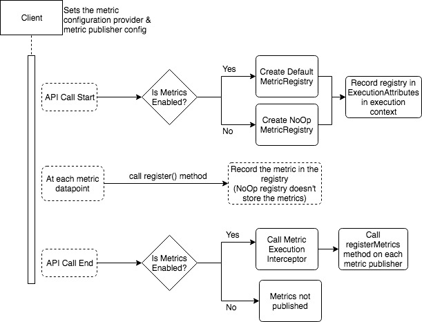
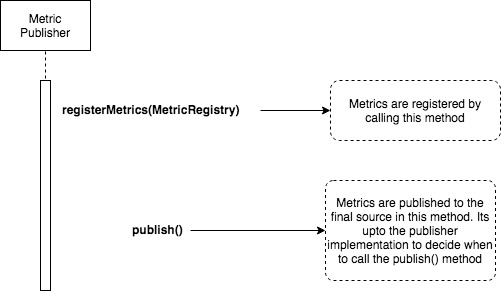
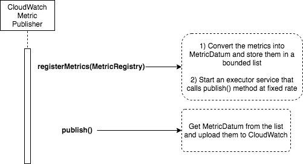
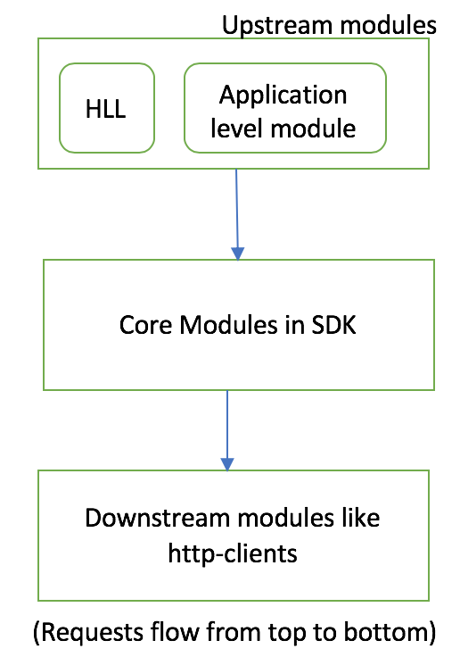

## Concepts
### Metric
* A representation of data collected
* Metric can be one of the following types: Counter, Gauge, Timer
* Metric can be associated to a category. Some of the metric categories are Default, HttpClient, Streaming etc

### MetricRegistry

* A MetricRegistry represent an interface to store the collected metric data. It can hold different types of Metrics
  described above
* MetricRegistry is generic and not tied to specific category (ApiCall, HttpClient etc) of metrics.
* Each API call has it own instance of a MetricRegistry. All metrics collected in the ApiCall lifecycle are stored in
  that instance.
* A MetricRegistry can store other instances of same type. This can be used to store metrics for each Attempt in an Api
  Call.
* [Interface prototype](prototype/MetricRegistry.java)

### MetricPublisher

* A MetricPublisher represent an interface to publish the collected metrics to a external source.
* SDK provides implementations to publish metrics to services like [Amazon
  CloudWatch](https://aws.amazon.com/cloudwatch/), [Client Side
  Monitoring](https://docs.aws.amazon.com/sdk-for-java/v1/developer-guide/sdk-metrics.html) (also known as AWS SDK
  Metrics for Enterprise Support)
* Customers can implement the interface and register the custom implementation to publish metrics to a platform not
  supported in the SDK.
* MetricPublishers can have different behaviors in terms of list of metrics to publish, publishing frequency,
  configuration needed to publish etc.
* Metrics can be explicitly published to the platform by calling publish() method. This can be useful in scenarios when
  the application fails and customer wants to flush metrics before exiting the application.
* [Interface prototype](prototype/MetricPublisher.java)

### Reporting

* Reporting is transferring the collected metrics to Publishers.
* To report metrics to a publisher, call the registerMetrics(MetricRegistry) method on the MetricPublisher.
* There is no requirement for Publisher to publish the reported metrics immediately after calling this method.


## Enabling Metrics

Metrics feature is disabled by default. Metrics can be enabled at client level in the following ways.

### Feature Flags (Metrics Provider)

* SDK exposes an [interface](prototype/MetricConfigurationProvider.java) to enable the metrics feature and specify
  options to configure the metrics behavior.
* SDK provides an implementation of this interface based on system properties.
* Here are the system properties SDK supports:
  - **aws.javasdk2x.metrics.enabled** - Metrics feature is enabled if this system property is set
  - **aws.javasdk2x.metrics.category** - Comma separated set of MetricCategory that are enabled for collection
* SDK calls the methods in this interface for each request ie, enabled() method is called for every request to determine
  if the metrics feature is enabled or not (similarly for other configuration options).
  -  This allows customers to control metrics behavior in a more flexible manner; for example using an external database
     like DynamoDB to dynamically control metrics collection. This is useful to enable/disable metrics feature and
     control metrics options at runtime without the need to make code changes or re-deploy the application.
* As the interface methods are called for each request, it is recommended for the implementations to run expensive tasks
  asynchronously in the background, cache the results and periodically refresh the results.

```java
ClientOverrideConfiguration config = ClientOverrideConfiguration
    .builder()
    // If this is not set, SDK uses the default chain with system property
    .metricConfigurationProvider(new SystemSettingsMetricConfigurationProvider())
    .build();

// Set the ClientOverrideConfiguration instance on the client builder
CodePipelineAsyncClient asyncClient =
    CodePipelineAsyncClient
        .builder()
        .overrideConfiguration(config)
        .build();
```

### Metrics Provider Chain

* Customers might want to have different ways of enabling the metrics feature. For example: use SystemProperties by
  default. If not use implementation based on Amazon DynamoDB.
* To support multiple providers, SDK allows setting chain of providers (similar to the CredentialsProviderChain to
  resolve credentials). As provider has multiple configuration options, a single provider is resolved at chain
  construction time and it is used throughout the lifecycle of the application to keep the behavior intuitive.
* If no custom chain is provided, SDK will use a default chain while looks for the System properties defined in above
  section.  SDK can add more providers in the default chain in the future without breaking customers.

```java
MetricConfigurationProvider chain = new MetricConfigurationProviderChain(
    new SystemSettingsMetricConfigurationProvider(),
    // example custom implementation (not provided by the SDK)
    DynamoDBMetricConfigurationProvider.builder()
                          .tableName(TABLE_NAME)
                          .enabledKey(ENABLE_KEY_NAME)
                          ...
                          .build(),
   );

ClientOverrideConfiguration config = ClientOverrideConfiguration
    .builder()
    // If this is not set, SDK uses the default chain with system property
    .metricConfigurationProvider(chain)
    .build();

// Set the ClientOverrideConfiguration instance on the client builder
CodePipelineAsyncClient asyncClient =
    CodePipelineAsyncClient
        .builder()
        .overrideConfiguration(config)
        .build();
```

### Metric Publishers Configuration

* If metrics are enabled, SDK by default uses a single publisher that uploads metrics to CloudWatch using default
  credentials and region.
* Customers might want to use different configuration for the CloudWatch publisher or even use a different publisher to
  publish to a different source.  To provide this flexibility, SDK exposes an option to set
  [MetricPublisherConfiguration](prototype/MetricPublisherConfiguration.java) which can be used to configure custom
  publishers.
* SDK publishes the collected metrics to each of the configured publishers in the MetricPublisherConfiguration.

```java
ClientOverrideConfiguration config = ClientOverrideConfiguration
    .builder()
    .metricPublisherConfiguration(MetricPublisherConfiguration
                                      .builder()
                                      .addPublisher(
                                          CloudWatchPublisher.builder()
                                                             .credentialsProvider(...)
                                                             .region(Region.AP_SOUTH_1)
                                                             .publishFrequency(5, TimeUnit.MINUTES)
                                                             .build(),
                                          CsmPublisher.create()).bu
                                      .build())
    .build();

// Set the ClientOverrideConfiguration instance on the client builder
CodePipelineAsyncClient asyncClient =
    CodePipelineAsyncClient
        .builder()
        .overrideConfiguration(config)
        .build();
```


## Modules
New modules are created to support metrics feature.

### metrics-spi
* Contains the metrics interfaces and default implementations that don't require other dependencies
* This is a sub module under `core`
* `sdk-core` has a dependency on `metrics-spi`, so customers will automatically get a dependency on this module.

### metrics-publishers
* This is a new module that contains implementations of all SDK supported publishers
* Under this module, a new sub-module is created for each publisher (`cloudwatch-publisher`, `csm-publisher`)
* Customers has to **explicitly add dependency** on these modules to use the sdk provided publishers


## Sequence Diagram

<b>Metrics Collection</b>

<div style="text-align: center;">



</div>

<b>MetricPublisher</b>

<div style="text-align: center;">



</div>

1. Client enables metrics feature through MetricConfigurationProvider and configure publishers through
   MetricPublisherConfiguration.
2. For each API call, a new MetricRegistry object is created and stored in the ExecutionAttributes. If metrics are not
   enabled, a NoOpMetricRegistry is used.
3. At each metric collection point, the metric is registered in the MetricRegistry object if its category is enabled in
   MetricConfigurationProvider.
4. The metrics that are collected once for a Api Call execution are stored in the METRIC_REGISTRY ExecutionAttribute.
5. The metrics that are collected per Api Call attempt are stored in new MetricRegistry instances which are part of the
   ApiCall MetricRegistry.  These MetricRegistry instance for the current attempt is also accessed through
   ATTEMPT_METRIC_REGISTRY ExecutionAttribute.
6. At end of API call, report the MetricRegistry object to MetricPublishers by calling registerMetrics(MetricRegistry)
   method. This is done in an ExecutionInterceptor.
7. Steps 2 to 6 are repeated for each API call
8. MetricPublisher calls publish() method to report metrics to external sources. The frequency of publish() method call
   is unique to Publisher implementation.
9. Client has access to all registered publishers and it can call publish() method explicitly if desired.


<b>CloudWatch MetricPublisher</b>

<div style="text-align: center;">



</div>

## Implementation Details
Few important implementation details are discussed in this section.

SDK modules can be organized as shown in this image.

<div style="text-align: center;">



</div>

* Core modules - Modules in the core directory while have access to ExecutionContext and ExecutionAttributes
* Downstream modules - Modules where execution occurs after core modules. For example, http-clients is downstream module
  as the request is transferred from core to http client for further execution.
* Upstream modules - Modules that live in layers above core. Examples are High Level libraries (HLL) or Applications
  that use SDK. Execution goes from Upstream modules to core modules.

### Core Modules
* SDK will use ExecutionAttributes to pass the MetricConfigurationProvider information through out the core module where
  core request-response metrics are collected.
* Instead of checking whether metrics is enabled at each metric collection point, SDK will use the instance of
  NoOpMetricRegistry (if metrics are disabled) and DefaultMetricRegistry (if metrics are enabled).
* The NoOpMetricRegistry class does not collect or store any metric data. Instead of creating a new NoOpMetricRegistry
  instance for each request, use the same instance for every request to avoid additional object creation.
* The DefaultMetricRegistry class will only collect metrics if they belong to the MetricCategory list provided in the
  MetricConfigurationProvider. To support this, DefaultMetricRegistry is decorated by another class to filter metric
  categories that are not set in MetricConfigurationProvider.

### Downstream Modules
* The MetricRegistry object and other required metric configuration details will be passed to the classes in downstream
  modules.
* For example, HttpExecuteRequest for sync http client, AsyncExecuteRequest for async http client.
* Downstream modules record the metric data directly into the given MetricRegistry object.
* As we use same MetricRegistry object for core and downstream modules, both metrics will be reported to the Publisher
  together.

### Upstream Modules
* As MetricRegistry object is created after the execution is passed from Upstream modules, these modules won't be able
  to modify/add to the core metrics.
* If upstream modules want to report additional metrics using the registered publishers, they would need to create
  MetricRegistry instances and explicitly call the methods on the Publishers.
* It would be useful to get the low-level API metrics in these modules, so SDK will expose APIs to get an immutable
  version of the MetricRegistry object so that upstream classes can use that information in  their metric calculation.

### Reporting
* Collected metrics are reported to the configured publishers at the end of each Api Call by calling
  `registerMetrics(MetricRegistry)` method on MetricPublisher.
* The MetricRegistry argument in the registerMetrics method will have data on the entire Api Call including retries.
* This reporting is done in `MetricsExecutionInterceptor` via `afterExecution()` and `onExecutionFailure()` methods.
* `MetricsExecutionInterceptor` will always be the last configured ExecutionInterceptor in the interceptor chain


## Performance
One of the main tenet for metrics is “Enabling default metrics should have minimal impact on the application
performance". The following design choices are made to ensure enabling metrics does not effect performance
significantly.
* When collecting metrics, a NoOpRegistry is used if metrics are disabled. All methods in this registry are no-op and
  return immediately.  This also has the additional benefit of avoid metricsEnabled check at each metric collection
  point.
* Metric publisher implementations can involve network calls and impact latency if done in blocking way. So all SDK
  publisher implementation will process the metrics asynchronously and does not block the actual request.


## Testing

To ensure performance is not impacted due to metrics, tests should be written with various scenarios and a baseline for
overhead should be created.  These tests should be run regularly to catch regressions.

### Test Cases

SDK will be tested under load for each of these test cases using the load testing framework we already have.  Each of
these test case results should be compared with metrics feature disabled & enabled, and then comparing the results.

1. Enable each metrics publisher (CloudWatch, CSM) individually.
2. Enable all metrics publishers.
3. Individually enable each metric category to find overhead for each MetricCategory.


