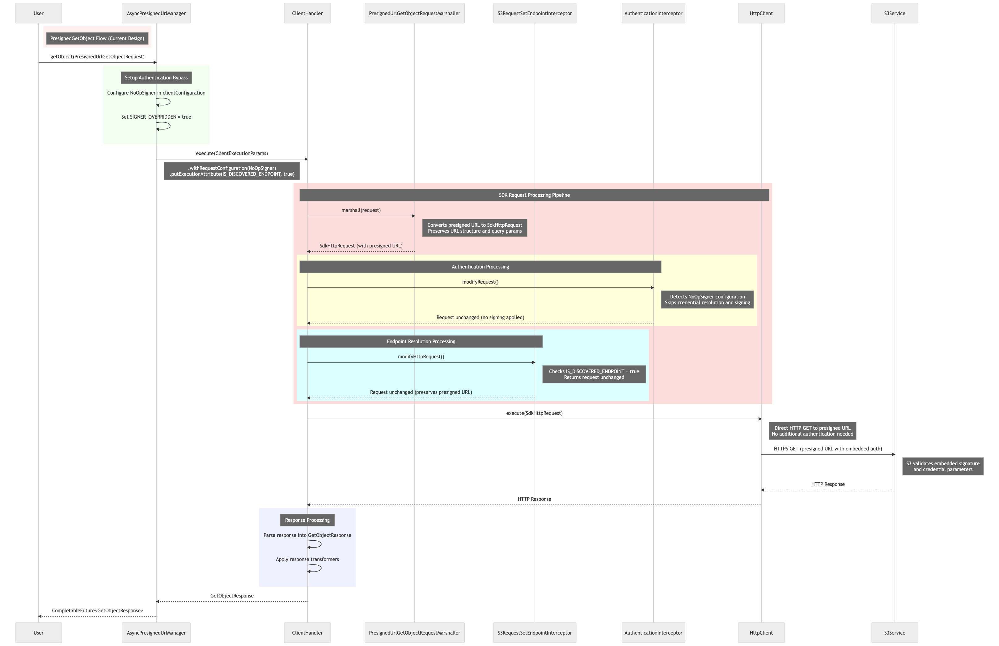

# S3 Pre-signed URL GET Design

## 1. Overview

This design introduces S3 object downloads using pre-signed URLs in AWS SDK Java v2, providing feature parity with v1. This implementation will allow users to download S3 objects through pre-signed URLs, while being able to use SDK benefits like automatic retries, metrics collection, and typed response objects. The solution integrates easily with existing S3AsyncClient and S3Client patterns, with TransferManager integration planned as a stretch goal.

## 2. Motivation

This design addresses an in-demand customer-requested feature ([GitHub Issue #2731](https://github.com/aws/aws-sdk-java-v2/issues/2731), [GitHub Issue #181](https://github.com/aws/aws-sdk-java-v2/issues/181)). Customers need to download S3 objects using pre-signed URLs, commonly used for temporary access to private objects.
The need for a different GetObject implementation stems from the architectural differences between standard S3 operations and pre-signed URL operations. The existing GetObject API to download S3 Objects assumes AWS credential-based authentication, standard S3 endpoint resolution and request signing via SigV4. However, pre-signed URLs are already signed and authenticated, requiring us to bypass authentication by skipping credential resolution and signing, bypass endpoint resolution by using the pre-signed URL's host directly, while preserving the SDK benefits like maintaining retry logic, metric collection, and streaming capabilities.

## 3. Scope

This design focuses on implementing pre-signed URL download functionality for Client level API - S3AsyncClient in AWS SDK Java v2. Implementation details for synchronous S3Client is covered in Appendix: S3Client Implementation Details. The implementation will support the primary GetObject functionality (including byte range requests), and existing v2 client configurations (retry, metrics). The solution also aligns with existing v2 streaming API patterns.

TransferManager-based pre-signed URL downloads including S3Multipart client used by Transfer manager and parallel range GET capabilities are out of scope for this design and will need to be addressed in a separate design.

## 4. High-Level Design for Pre-signed URL GET

This design introduces a new helper API AsyncPresignedUrlManager which can be instantiated via the existing S3AsyncClient. This manager provides a clean abstraction layer that preserves SDK benefits while handling the unique requirements of pre-signed URL requests.

### Usage Example

```java
S3AsyncClient s3Client = S3AsyncClient.create();
// Get Presigned URL manager from client
AsyncPresignedUrlManager presignManager = s3Client.presignedManager();
CompletableFuture<GetObjectResponse> response = presignManager.getObject(
    PresignedUrlGetObjectRequest.builder()
        .presignedUrl(presignedUrl)
        .build()
);
```

### 4.1 Core API

**AsyncPresignedUrlManager Interface**
Handles all pre-signed URL operations for S3AsyncClient.

```java
@SdkPublicApi
public interface AsyncPresignedUrlManager {
    CompletableFuture<GetObjectResponse> getObject(PresignedUrlGetObjectRequest request);
    // others..
}
```

This is similar to the Automatic request batching feature. Here we provide a helper API which internally uses this or same client to do the call. This internally decorates or wraps the API calls. The same pattern applies to synchronous S3Client operations.

### 4.2 Architecture Integration

The AsyncPresignedUrlManager integrates with the existing S3AsyncClient through a helper API Pattern.

**S3AsyncClient Interface Extension:**
In existing S3AsyncClient the PresignedUrlManager API will be code generated as below:

```java
public interface S3AsyncClient extends AwsClient {
    // Existing S3 Operations ..
    
    // New presigned URL manager access
    AsyncPresignedUrlManager presignedManager();
}
```

**DefaultS3AsyncClient Integration:**
The DefaultS3AsyncClient will be instantiated via DefaultS3AsyncClient passing its clientHandler and other fields required to make the call.

```java
public class DefaultS3AsyncClient implements S3AsyncClient {
    @Override
    public AsyncPresignedUrlManager presignedManager() {
        return new DefaultAsyncPresignedUrlManager(clientHandler, protocolFactory, 
                                                  protocolMetadata, clientConfiguration);
    }
}
```

### 4.3 Sequence Flow for new GetObject



The key difference in pre-signed URL handling is the explicit bypass of normal request processing, while maintaining retry, metrics, and logging functionality. Since pre-signed URLs have resolved endpoint and signature in their URL, we do not need signing and endpoint resolution.

In order to skip signing we will use client override configuration using NoOpSigner() similar to CRT and a new execution attribute SdkInternalExecutionAttribute.SKIP_ENDPOINT_RESOLUTION to skip the endpoint configuration.

```java
// bypass signing
.withRequestConfiguration(this.clientConfiguration.toBuilder()
    .option(SIGNER, new NoOpSigner())
    .option(SIGNER_OVERRIDDEN, true)
    .build())

// override endpoint configuration using a new execution attribute
.putExecutionAttribute(SdkInternalExecutionAttribute.SKIP_ENDPOINT_RESOLUTION, true)
```

```java
public final class SdkInternalExecutionAttribute {
    // Existing attributes...
    public static final ExecutionAttribute<Boolean> IS_DISCOVERED_ENDPOINT = 
        new ExecutionAttribute<>("IsDiscoveredEndpoint");
    
    // New attribute for presigned URL operations
    public static final ExecutionAttribute<Boolean> SKIP_ENDPOINT_RESOLUTION = 
        new ExecutionAttribute<>("SkipEndpointResolution");
}
```

**Pros:**
- Clean separation - doesn't modify core interceptors
- Isolated changes - all pre-signed URL logic in one place
- Similar approach used as in S3 CRT client for skipping signing
- Execution attribute is used only for skipping the endpoint configuration

**Cons:**
- NoOpSigner() is deprecated, with no direct replacement
- Uses the internal execution attributes which could change in the future

## 5. Low-Level Design for Pre-signed URL GET

### 5.1 Implementation

**DefaultAsyncPresignedUrlManager Class**

Internal class implementation of the AsyncPresignedUrlManager interface that implements getObject for presigned URLs. It uses AsyncClientHandler with NoOpSigner configuration and skips checksum validation for pre-signed URL operations since S3 does not send the checksum headers for pre-signed URL get object.

```java
@SdkInternalApi
public final class DefaultAsyncPresignedUrlManager implements AsyncPresignedUrlManager {
    private final AsyncClientHandler clientHandler;
    private final AwsS3ProtocolFactory protocolFactory;
    private final SdkClientConfiguration clientConfiguration;
    private final ProtocolMetadata protocolMetadata;
    
    @Override
    public <T> CompletableFuture<T> getObject(PresignedUrlGetObjectRequest request,
                                             AsyncResponseTransformer<GetObjectResponse, T> responseTransformer) {
        HttpResponseHandler<GetObjectResponse> responseHandler = protocolFactory.createResponseHandler(
                GetObjectResponse::builder, new XmlOperationMetadata().withHasStreamingSuccessResponse(true));
        HttpResponseHandler<AwsServiceException> errorResponseHandler = protocolFactory.createErrorResponseHandler();
        
        // Implementation method, return clientHandler.execute(..)
        // skip signing by using client configuration - NoOpSigner()
        // skip endpoint resolution using execution attributes 
    }
    // Other method implementations...
}
```

**PresignedUrlGetObjectRequest Class**

Handwritten Request class that will have URL and Range as class attributes.

```java
@SdkPublicApi
@Immutable
@ThreadSafe
public class PresignedUrlGetObjectRequest 
        implements ToCopyableBuilder<PresignedUrlGetObjectRequest.Builder, PresignedUrlGetObjectRequest> {
    private final String presignedUrl;
    private final Long rangeStart;
    private final Long rangeEnd;
    
    // rest of implementation ..
    // builder method ..
}
```

**PresignedUrlGetObjectRequestMarshaller Class**

Custom marshaller that converts URI to HTTP request.

```java
@SdkInternalApi
public class PresignedUrlGetObjectRequestMarshaller implements Marshaller<InternalPresignedUrlGetObjectRequest> {
    @Override
    public SdkHttpFullRequest marshall(InternalPresignedUrlGetObjectRequest request) {
        // update the request with URI
        // build HTTP request from PresignedUrlGetObjectRequest request
        // Add Range header if present in the request
        // ...
        return requestBuilder.build();
    }
}
```

### 5.2 Codegen Changes

To implement the helper API pattern (s3AsyncClient.presignedUrlManager()), we need to integrate this feature into the existing code generation process.

**customization.config**

```json
{ 
    "presignedUrlManagerSupported": true 
}
```

**Codegen Logic**

```java
if (customizationConfig.getPresignedUrlManagerSupported()) {
    generatePresignedUrlManager(serviceModel);
}
```

## 6. Design Approaches Explored

### 6.1 Approach 1: Dedicated PresignedUrlManager (Selected)

Creates a manager PresignedUrlManager for pre-signed URL operations, separate from the S3Client and bypass the normal processing flow.

**Pros:**
- Clean separation of concerns
- Client features like metric collector and retries can be utilized
- Follows SDK v2 patterns with builder and request objects
- Extensible for future presigned operations (PUT, DELETE, etc.)
- No modifications to core S3Client or code generation
- Supports both sync and async operations

**Cons:**
- Introduces a new public API surface, not a one-to-one migration experience for users from v1 to v2
- Users need to learn a new interface alongside S3Client

### 6.2 Alternative Approaches Considered

**S3Client Integration:** Integrating pre-signed URL operations directly into existing S3Client interface.
- **Pros:** Consistent with existing patterns, direct migration path
- **Cons:** Complex code generation changes, potential side effects on existing operations

**S3Presigner Extension:** Extending existing S3Presigner class to both generate and execute pre-signed URLs.
- **Pros:** Logical extension, reuses existing objects
- **Cons:** Breaks current S3Presigner patterns, circular dependency issues


## FAQ

**Q: Why doesn't PresignedUrlGetObjectRequest extend S3Request/SdkRequest?**

A: While extending S3Request would provide access to RequestOverrideConfiguration, many of these configurations (like credentials provider, signers) are incompatible with presigned URL execution and could cause conflicts. Instead, we use a standalone request PresignedUrlGetObjectRequest with only the essential parameters (presignedUrl, rangeStart, rangeEnd). Internally, this gets converted to an SdkRequest for use with ClientHandler.

In DefaultPresignedUrlManager we can convert the standalone request to an internal SdkRequest:

```java
public <ReturnT> ReturnT getObject(PresignedUrlGetObjectRequest request, ...) {
    // Convert standalone request to internal SdkRequest
    InternalPresignedUrlGetObjectRequest internalRequest = 
        InternalPresignedUrlGetObjectRequest.builder()
            .url(request.presignedUrl())
            .rangeStart(request.rangeStart())
            .rangeEnd(request.rangeEnd())
            .build();
    
    // Use with ClientHandler
    return clientHandler.execute(..., internalRequest, ...);
}
```

**Internal Implementation class - InternalPresignedUrlGetObjectRequest**

```java
@SdkInternalApi
final class InternalPresignedUrlGetObjectRequest extends S3Request {
    private final String url;
    private final Long rangeStart; 
    private final Long rangeEnd;
}
```


**Q: How does this approach handle SDK features like retries, timeouts, and metrics?**

A: The PresignedUrlManager leverages the same underlying SDK infrastructure as S3Client, including ClientHandler, retry policies, and metrics collection. Users get all the benefits of SDK configuration while maintaining the specialized behavior needed for presigned URLs.


## Appendix

### Appendix: S3Client Implementation Details

The same design applies to S3Client with synchronous operations. We would need two PresignedUrlManagers- PresignedUrlManager for S3Client (synchronous) and AsyncPresignedUrlManager for S3AsyncClient (asynchronous).

**PresignedUrlManager Interface (Synchronous)**

```java
@SdkPublicApi
public interface PresignedUrlManager {
    GetObjectResponse getObject(PresignedUrlGetObjectRequest request);
    
    <T> T getObject(PresignedUrlGetObjectRequest request, 
                   ResponseTransformer<GetObjectResponse, T> responseTransformer);
    
    GetObjectResponse getObject(PresignedUrlGetObjectRequest request, Path destination);
    
    ResponseBytes<GetObjectResponse> getObjectAsBytes(PresignedUrlGetObjectRequest request);
}
```

**S3Client Interface**

```java
public interface S3Client extends AwsClient {
    PresignedUrlManager presignedManager();
}
```

**DefaultS3Client Implementation**

```java
public class DefaultS3Client implements S3Client {
    @Override
    public PresignedUrlManager presignedManager() {
        return new DefaultPresignedUrlManager(clientHandler, protocolFactory, 
                                             protocolMetadata, clientConfiguration);
    }
}
```

## References

**Existing Issues:**
- [GitHub Issue #2731](https://github.com/aws/aws-sdk-java-v2/issues/2731)
- [GitHub Issue #181](https://github.com/aws/aws-sdk-java-v2/issues/181)

**AWS Documentation:**
- [S3 Pre-signed URLs](https://docs.aws.amazon.com/AmazonS3/latest/userguide/PresignedUrlUploadObject.html)

